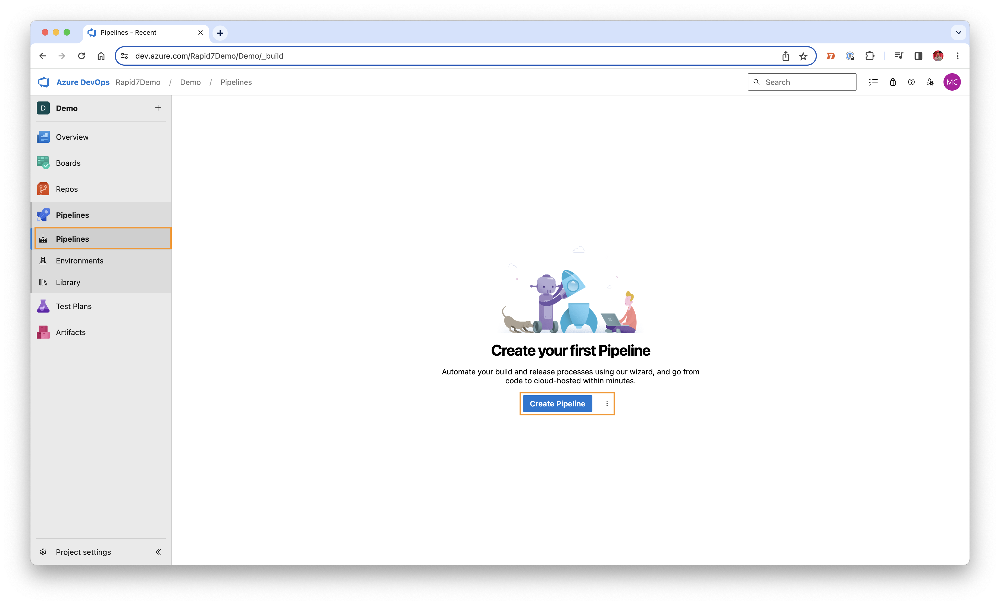
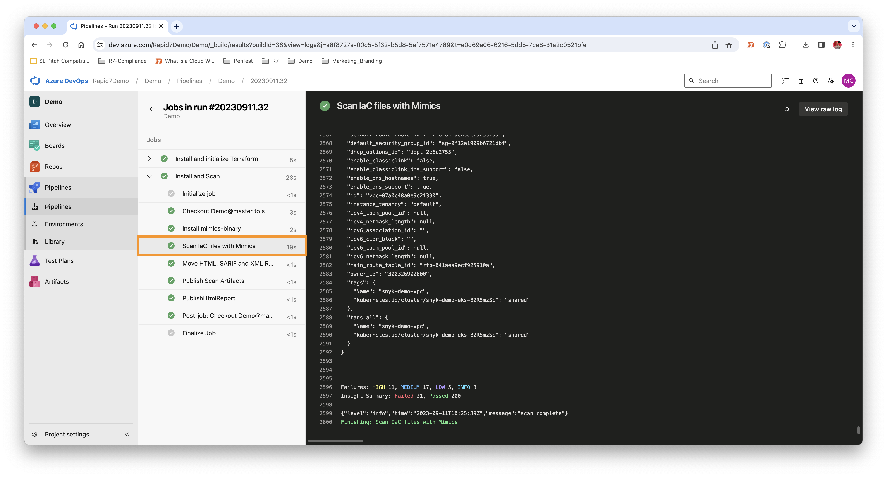
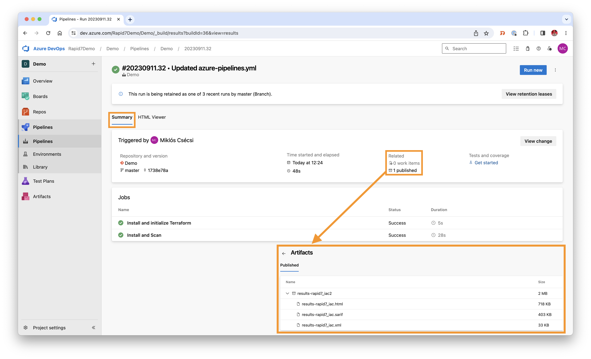
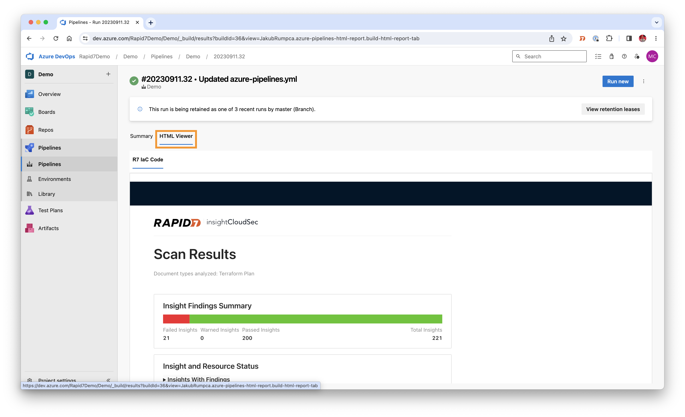
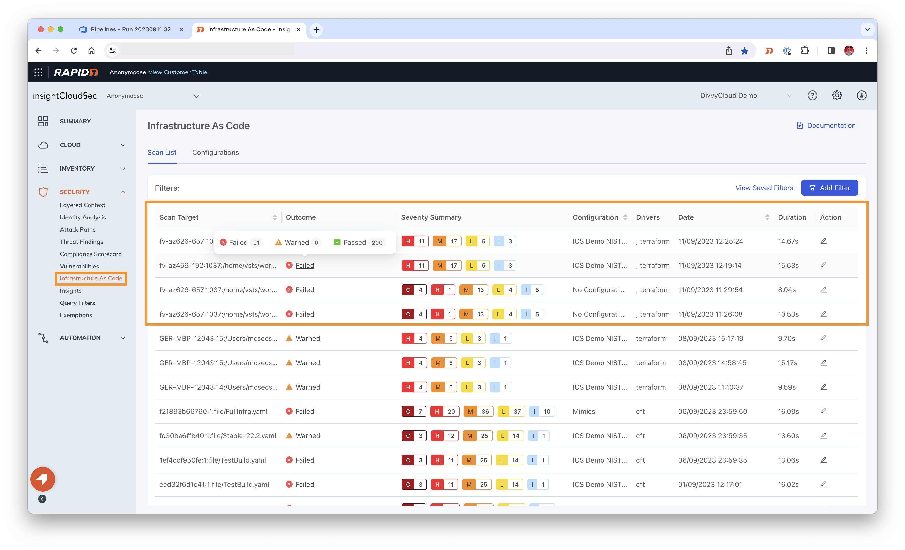
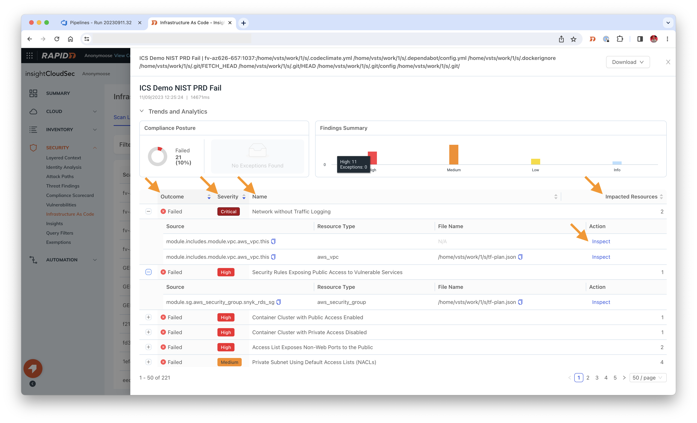

# Azure Pipelines

In this pipeline implementation we're going to embed the mimics tool into a simple Azure DevOps pipeline by using the "famous" and "infamous" [Juice Shop](https://github.com/juice-shop/juice-shop) project.</br>    
During the pipeline implementation we're also going to use the lightweight "Html Viewer" tool in order to display the scan results in the Azure Devops environment: [html-viewer-plugin](https://marketplace.visualstudio.com/items?itemName=JakubRumpca.azure-pipelines-html-report)

## List of content
- [Installing Azure Extension & configuring the service connection](#1-splunk-setup)<br/>
- [Azure Boards](#azure-boards)<br/>


## Installing Azure Extension & configuring the service connection

1. Install the [extension "Html Viewer"](https://marketplace.visualstudio.com/items?itemName=JakubRumpca.azure-pipelines-html-report) into your Azure DevOps environment. This extension is available via the Visual Studio Marketplace.
  
 

Select the organisation where your project is held and click `Install`.
 

You can always check the installed plugins in your Azure DevOps organisation settings >> Extensions
 

2. Configure the pipeline by using [this configuration yaml-file](https://github.com/mcsnyk/Rapid7-mimics-pipelines/blob/main/AzurePipelines/AzurePipelines-generic-binary.yml) to install the mimics tool as a binary or [this configuration yaml-file](https://github.com/mcsnyk/Rapid7-mimics-pipelines/blob/main/AzurePipelines/AzurePipelines-generic-Docker.yml) to use mimics as a Container in your pipeline - as an example. If you don't have any pipelines for your project, select the Pipelines >> Create pipeline option.
 

3. We now have to define the `API_KEY` and `BASE_URL` variables in order to run the pipeline. Please select the "Variables" option first. Please also make sure that you have configured the connection to your cloud provider (in the provided example I show how to configure the AWS CLI by providing the `AWS_ACCESS_KEY_ID` and `AWS_SECRET_ACCESS_KEY`). It is needed, because Terraform needs to create a json file based on the IaC files, the mimics tool is able to parse it through and assess misconfigurations in it. 

     

4. Let's run our pipeline! In the example script we used the latest ubuntu image, please feel free to use another vmImage or even your own custom pool.     
    
:wrench: Here is a list of the available binaries of the mimics tool:
- [macOS Universal](https://artifacts.rapid7.com/cloudsec/mimics/v1.2.5/mimics_1.2.5_darwin_all)
- [Linux x86-64](https://artifacts.rapid7.com/cloudsec/mimics/v1.2.5/mimics_1.2.5_linux_amd64)
- [Linux ARM](https://artifacts.rapid7.com/cloudsec/mimics/v1.2.5/mimics_1.2.5_linux_arm64)
- [Windows x86-64](https://artifacts.rapid7.com/cloudsec/mimics/v1.2.5/mimics_1.2.5_windows_amd64.exe)
- [Windows ARM](https://artifacts.rapid7.com/cloudsec/mimics/v1.2.5/mimics_1.2.5_windows_arm64.exe)

During the pipeline exectution we can look inside the pipeline and observe the findings and remediation advice provided by the mimics tool:
   

5. After the pipeline run, we can take a look at the results and the published artifacts. On the Summary tab we can find the artifacts and the results of the different jobs. The output of the mimics tool can be configured (available extentions: XML, SARIF and HTML, or all of them).
  
 
6. As we added the HTML Viewer tool, we can immediately observe our vulnerabilities on a separate tab, the HTML Viewer tab.
 

7. We have the option to send the results immediately to the insideCloudSec webUI. In the pipeline configuration the additional flag `--save-report` can 
On the Security >> Infrastructure as Code tab we can see the results of the pipeline run. If we change the applied Configuration, we can apply different built-in (industry-standard) or custom rulesets "Insights".


8. If we hover the mouse over the "Outcome" field, we can really look inside of a given scan. We don't only see the name, severity or number of the impacted resources, but we can immediately take action and observe the issues!



## Azure Boards     

Azure Boards is ideal for project planning and tracking, offering tools for agile teams to manage their work, including backlogs, sprints, and dashboards for reporting. When using InsightCloudSec, we can capture Infrastructure as Code (IaC) misconfigurations and immediately create issues for a Kanban board or work items in Azure Boards, streamlining the process of managing and rectifying security and compliance issues in cloud environments.      

:hammer_and_wrench: How does it work?<br/>
InsightCloudSec's mimICS tool meticulously scans Infrastructure as Code (IaC) configurations, encompassing a variety of formats such as Terraform, CloudFormation, and Azure Bicep, among others. Capable of generating a **SARIF output** (also XML and HTML), it provides a comprehensive summary that details the rules applied during the scan, all invocations - including those that result in errors due to incompatibilities with file formats like HTML or Terraform - and, crucially, the scan results themselves. Leveraging the sophisticated capabilities of Azure Boards' API, these detailed objects can be parsed and seamlessly integrated, allowing for the direct transmission of findings to Azure Boards for streamlined issue tracking and management.      

Just to get an insight into the SARIF file to be parsed:<br/>

<details>
<summary>Inside of the SARIF file - the <b>rules object</b> looks like this - we will not use this this time</summary>

```json
"rules": [
  {
    "id": "backoffice:100",
    "name": "Private Subnet Using Default Access Lists (NACLs)",
    "shortDescription": {
      "text": "Private Subnet Using Default Access Lists (NACLs)"
    },
    "fullDescription": {
      "text": "Identify private subnets that use default Access Lists (NACLs). These are typically extremely permissive and allow all ingress/egress traffic through to the instance layer"
    },
    "properties": {
      "r7Severity": 3,
      "security-severity": "5"
    }
  },
...
]
```
</details>
         
<details>
<summary>Inside of the SARIF file - the <b>invocation object</b>b> looks like this - we will also not use this this time</summary>
    
```json
"invocations": [
  {
    "executionSuccessful": true,
    "toolExecutionNotifications": [
      {
        "descriptor": {
          "id": "ESelectParser"
        },
        "message": {
          "text": "Unable to determine which parser to use for file /home/vsts/work/1/s/.dockerignore"
        },
        "level": "note"
      }
    ]
  },
...
]
```
</details>

What we will use is the **results array and its objects** (the IaC misconfigurations) inside of it. 

<details>
<summary>An example for a finding:</summary>summary>

```json
"results": [
  {
    "ruleId": "backoffice:93",
    "level": "error",
    "message": {
      "text": "All aws_instance resources should have a security group assigned that is not the default for a particular VPC."
    },
    "locations": [
      {
        "physicalLocation": {
          "artifactLocation": {
            "uri": "/home/vsts/work/1/s/plan.json"
          },
          "region": {
            "startLine": 1,
            "startColumn": 2589,
            "endLine": 1,
            "endColumn": 2844,
            "snippet": {
              "text": "{\n  \"ami\": \"ami-0c4c4bd6cf0c5fe52\",\n  \"credit_specification\": [],\n  \"get_password_data\": false,\n  \"hibernation\": null,\n  \"iam_instance_profile\": \"EC2InstanceProfile\",\n  \"instance_type\": \"t2.micro\",\n  \"launch_template\": [],\n  \"source_dest_check\": true,\n  \"timeouts\": null,\n  \"volume_tags\": null\n}\n"
            }
          }
        },
        "logicalLocations": [
          {
            "name": "aws_instance.server.vpc_security_group_ids",
            "fullyQualifiedName": "/home/vsts/work/1/s/plan.json:aws_instance.server.vpc_security_group_ids",
            "kind": "resource"
          }
        ],
        "properties": {
          "resourceType": "aws_instance",
          "changes": "--- a//home/vsts/work/1/s/plan.json\n+++ b//home/vsts/work/1/s/plan.json\n@@ -8,5 +8,8 @@\n   \"launch_template\": [],\n   \"source_dest_check\": true,\n   \"timeouts\": null,\n-  \"volume_tags\": null\n+  \"volume_tags\": null,\n+  \"vpc_security_group_ids\": [\n+    \"<SECURITY-GROUP-ID>\"\n+  ]\n }\n"
        }
      }
    ],
    "partialFingerprints": {
      "Document": "0ea81df04c0520457f17aab9da6b74dc9995cd9decb52dc2e5674158777b84b6",
      "Rule": "c95d28fe778b04f3b65f1814a67070eccdb88c3f35f6151a3022008f1b02605f",
      "Sink": "b7849f58c243b746bfc651ff23b5d490cbe3e6a609e945eccf335b1a33d2bcab",
      "Source": "d27d39bad0d9e71861437b0b1349f4f265420e247e4bd5406739ea6fe730998d"
    },
    "relatedLocations": [
      {
        "physicalLocation": {
          "artifactLocation": {
            "uri": "/home/vsts/work/1/s/plan.json"
          },
          "region": {
            "startLine": 1,
            "startColumn": 2589,
            "endLine": 1,
            "endColumn": 2844,
            "snippet": {
              "text": "{\n  \"ami\": \"ami-0c4c4bd6cf0c5fe52\",\n  \"credit_specification\": [],\n  \"get_password_data\": false,\n  \"hibernation\": null,\n  \"iam_instance_profile\": \"EC2InstanceProfile\",\n  \"instance_type\": \"t2.micro\",\n  \"launch_template\": [],\n  \"source_dest_check\": true,\n  \"timeouts\": null,\n  \"volume_tags\": null\n}\n"
            }
          }
        },
        "logicalLocations": [
          {
            "name": "aws_instance.server",
            "fullyQualifiedName": "/home/vsts/work/1/s/plan.json:aws_instance.server",
            "kind": "resource"
          }
        ],
        "properties": {
          "resourceType": "aws_instance"
        }
      }
    ]
  }
]
```
</details>

:hammer_and_wrench: How to set up the integration with Boards?
First of all, we need to generate a personal access token (PAT).
