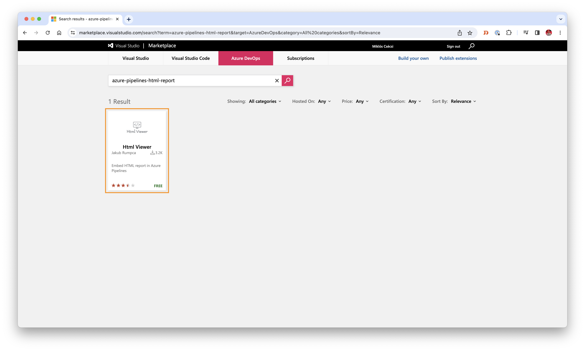
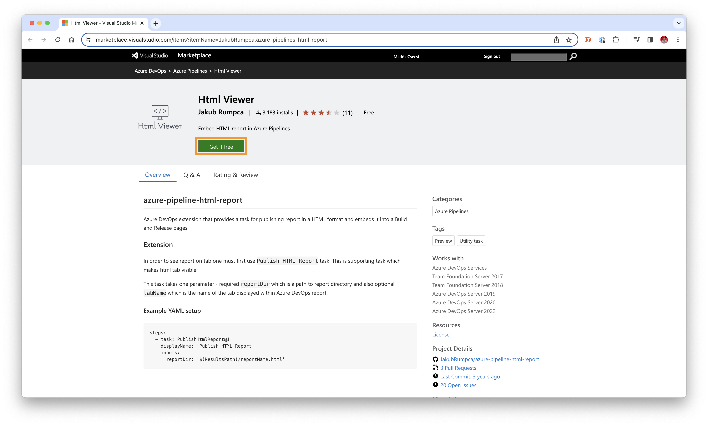
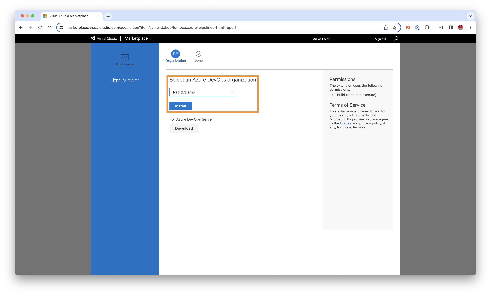
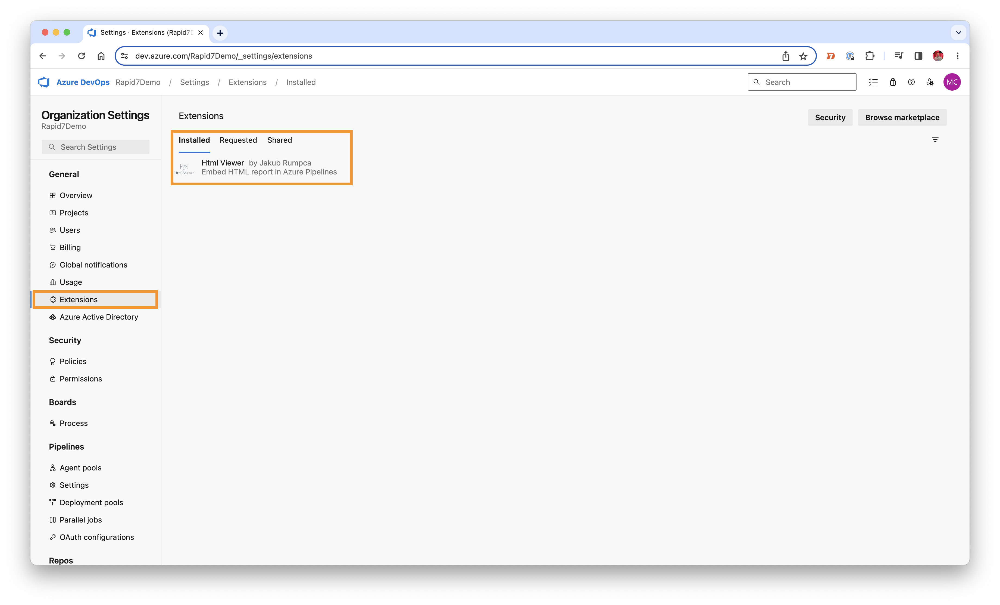
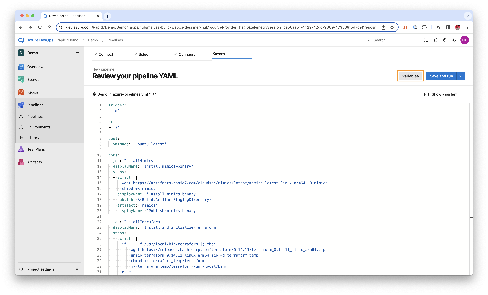
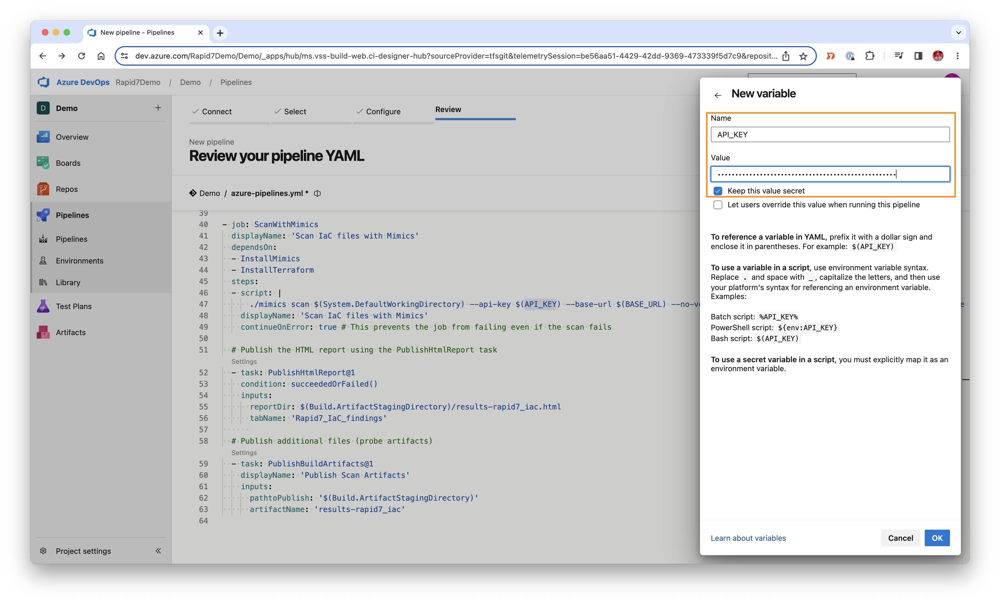

# Azure Pipelines

In this pipeline implementation we're going to embed the mimics tool into a simple Azure DevOps pipeline by using the "famous" and "infamous" [Juice Shop](https://github.com/juice-shop/juice-shop) project.     
During the pipeline implementation we're also going to use the lightweight "Html Viewer" tool in order to display the scan results in the Azure Devops environment: [html-viewer-plugin](https://marketplace.visualstudio.com/items?itemName=JakubRumpca.azure-pipelines-html-report)

## Installing Azure Extension & configuring the service connection

1. Install the [extension "Html Viewer"](https://marketplace.visualstudio.com/items?itemName=JakubRumpca.azure-pipelines-html-report) into your Azure DevOps environment. This extension is available via the Visual Studio Marketplace.  

Select the organisation where your project is held and click "Install".

You can always check the installed plugins in your Azure DevOps organisation settings >> Extensions

2. Configure the pipeline by using this configuration yaml-file as an example
3. We have to define the "API_KEY" and "BASE_URL" variables in order to run the pipeline. Please select the "Variables" option first. 
    

4. Let's run our pipeline! 

