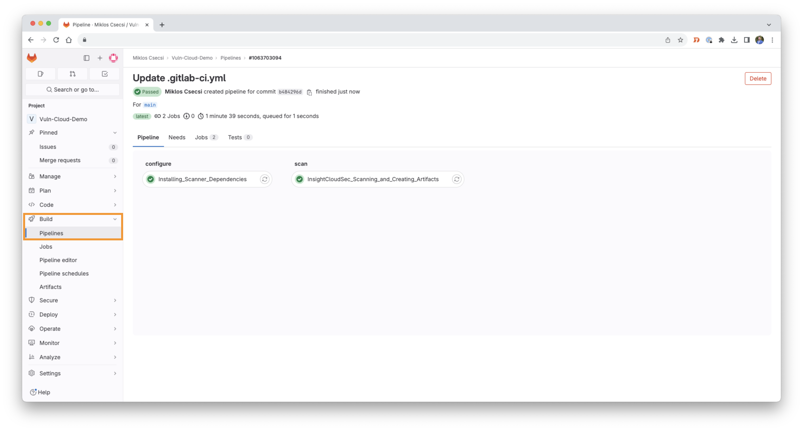
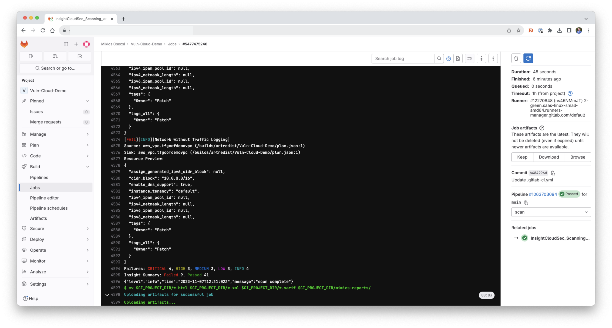
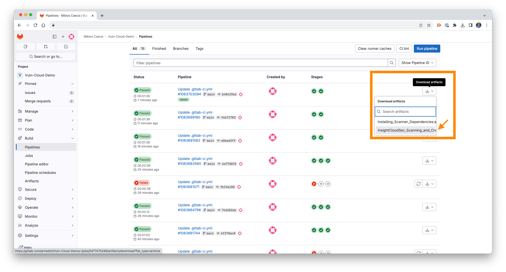

# Gitlab Runner CI/CD pipeline

Create a new pipeline and use the [template file](https://github.com/mcsnyk/Rapid7-mimics-pipelines/blob/main/GitlabCICD/gitlab-ci.yml).     
After a successful pipeline run, you can download the created Artifacts.     
      
Some screenshots:    
 
 
 
